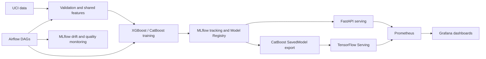

# Credit Card Default MLOps Project

An end-to-end MLOps example for the UCI Default of Credit Card Clients dataset. The repository keeps the original XGBoost pipeline and adds CatBoost training, MLflow tracking and registry, FastAPI and TensorFlow Serving, and Prometheus/Grafana monitoring.

## Architecture



The checked-in bootstrap snapshot contains the existing MLflow registry database and artifacts. The CatBoost Production Version 1 TensorFlow SavedModel is included as a serving artifact. Starting the system does not train a model or create a new model version.

## Repository layout

```text
config/config.yaml                         Shared data, model, feature and serving configuration
dags/ml_pipeline_dag.py                    Training and production monitoring DAGs
docker/                                    Pinned service Dockerfiles
mlflow/bootstrap/                          Registry DB and artifacts seeded on first startup
monitoring/prometheus.yml                  Prometheus scrape targets
monitoring/grafana/provisioning/           Prometheus datasource and dashboards
monitoring/tf_serving/                     TensorFlow Serving metrics configuration
models/tf_serving/CreditCardDefaultCatBoost/1/
                                            Existing Version 1 SavedModel artifact
serving/app.py                             FastAPI inference and feedback endpoints
serving/export_catboost_tf_savedmodel.py   Version-aware registry exporter with parity check
src/data/                                  Ingestion and validation
src/features/engineering.py                Shared feature engineering
src/models/                                XGBoost, CatBoost, evaluation, registry, drift
tests/                                     Unit, serving, validation and monitoring tests
docker-compose.yml                         Complete local service stack
requirements.txt                           Pinned runtime dependencies
requirements-dev.txt                       Pinned test and lint dependencies
```

## Requirements

- Docker Desktop with Docker Compose v2
- Python 3.11 for local development and tests
- Git

All Python runtime and developer dependencies are pinned. The Docker images use fixed service versions. Airflow and the complete stack require more memory than the MLflow/serving/monitoring subset.

## A. Run the existing model (no training)

### Clone and install local tools

```bash
git clone https://github.com/uzuz3737/ml-ops-project.git
cd ml-ops-project
git switch main  # use pairoj_catboot until its PR has been merged
python -m venv .venv
```

Activate the environment and install dependencies:

```powershell
# Windows PowerShell
.venv\Scripts\Activate.ps1
```

```bash
# Linux/macOS
source .venv/bin/activate
```

```bash
python -m pip install -r requirements-dev.txt
```

### Start MLflow, serving and monitoring

```bash
docker-compose up --build -d mlflow fastapi-serving tf-serving prometheus grafana
```

On first startup, Compose copies `mlflow/bootstrap/mlflow.db` and its artifacts into the ignored local `mlruns/` and `mlartifacts/` runtime directories only if the local MLflow database does not exist. Existing MLflow state is never overwritten. The CatBoost exporter checks the Registry Production version; when the checked-in SavedModel matches it, the exporter reuses the artifact and does not need the training dataset.

Wait for service readiness:

```bash
docker-compose ps
```

### Services

| Service | URL | Purpose |
| --- | --- | --- |
| MLflow | [http://localhost:8000](http://localhost:8000) | Tracking UI and Model Registry |
| FastAPI | [http://localhost:8001](http://localhost:8001) | Existing CatBoost Version 1 API by default; Swagger at `/docs` |
| TensorFlow Serving | [http://localhost:8501](http://localhost:8501) | CatBoost REST prediction API |
| TensorFlow Serving model status | [http://localhost:8501/v1/models/CreditCardDefaultCatBoost](http://localhost:8501/v1/models/CreditCardDefaultCatBoost) | Loaded model version and availability |
| TensorFlow Serving metrics | [http://localhost:8502/monitoring/prometheus/metrics](http://localhost:8502/monitoring/prometheus/metrics) | TF Serving Prometheus metrics |
| Prometheus | [http://localhost:9090](http://localhost:9090) | Scrape targets and PromQL |
| Grafana | [http://localhost:3000](http://localhost:3000) | Dashboards; local default login `admin` / `admin` |
| Airflow (optional full stack) | [http://localhost:8080](http://localhost:8080) | Pipeline and monitoring DAGs |

The TensorFlow Serving monitoring dashboard is at [http://localhost:3000/d/tf-serving-catboost-monitoring/tensorflow-serving-model-monitoring](http://localhost:3000/d/tf-serving-catboost-monitoring/tensorflow-serving-model-monitoring). It shows request count/rate, error rate, latency quantiles, model version, and availability (`1` available, `0` unavailable).

### Verify MLflow Registry Version 1

The current CatBoost production model is `CreditCardDefaultCatBoost`, Version `1`, stage `Production`. From the activated local Python environment:

```bash
python -c "import mlflow; mlflow.set_tracking_uri('http://localhost:8000'); model=mlflow.catboost.load_model('models:/CreditCardDefaultCatBoost/1'); print(type(model).__name__)"
```

The FastAPI service uses CatBoost Version 1 by default so a clone can serve immediately from the checked-in Registry snapshot. Select XGBoost with `SERVING_MODEL_FAMILY=xgboost` if its registered model is available. TensorFlow Serving uses the CatBoost SavedModel derived from Registry Version 1.

### Send a prediction

The TensorFlow Serving endpoint accepts the 23 raw input fields in the order shown below. Feature engineering runs inside the SavedModel and matches `src/features/engineering.py`.

```bash
curl -X POST http://localhost:8501/v1/models/CreditCardDefaultCatBoost:predict \
  -H 'Content-Type: application/json' \
  -d '{"instances":[[50000,2,2,1,24,2,2,-1,-1,-2,-2,3913,3102,689,0,0,0,0,689,0,0,0,0]]}'
```

The response contains probabilities in `[no_default, default]` order. Verify the loaded version and health:

```bash
curl http://localhost:8501/v1/models/CreditCardDefaultCatBoost
curl http://localhost:8502/monitoring/prometheus/metrics
```

In Prometheus, check `up{job="tensorflow-serving"}` equals `1`. Send predictions to populate request-rate and latency panels; error rate displays `0` when no errors have occurred.

Stop services without deleting Registry state or model files:

```bash
docker-compose down
```

Avoid `docker-compose down -v` and do not delete `mlruns/`, `mlartifacts/`, or `models/tf_serving/` if you want to retain local runs and exported models.

### Run the full stack

To also start Airflow and its metadata database:

```bash
docker-compose up --build -d
```

## B. Retrain models (only when deliberately requested)

Training commands create new MLflow runs and may create a new Registry version if the configured validation ROC-AUC gate is met. They are not part of the existing-model startup flow above.

1. Prepare the UCI data and splits:

   ```bash
   python -m src.data.ingestion
   ```

2. Validate data and the shared feature inputs:

   ```bash
   python -m src.data.validation
   ```

3. Train one model explicitly:

   ```bash
   python -m src.models.train          # XGBoost
   python -m src.models.train_catboost # CatBoost
   ```

Training settings, seeds, feature rules, evaluation threshold and Registry gates are in `config/config.yaml`. CatBoost uses the same split and shared feature engineering as XGBoost.

## Tests and code checks

Run the test suite:

```bash
pytest tests/ -v --cov=src --cov=serving --cov-report=term-missing
```

Tests use fixed predictors or the existing CatBoost Registry Version 1; they do not fit new XGBoost/CatBoost models. The Registry integration test skips when MLflow is not running. For a full run including that test, start the MLflow service first.

Run lint and Python syntax checks:

```bash
flake8 src/ serving/ dags/ tests/ --count --show-source --statistics
python -m compileall -q src serving dags
```

## Reproducibility notes

- Python runtime and test requirements are version-pinned; service container tags and the MLflow exporter dependencies are pinned.
- `config/config.yaml` is the source for data split seed, model settings, feature rules, evaluation threshold, tracking URI, and serving settings.
- MLflow's checked-in bootstrap snapshot supplies the existing registry metadata and artifacts. After first startup, runtime state is stored under ignored `mlruns/` and `mlartifacts/` directories.
- CatBoost Version 1 SavedModel is included in the repository. Its probability output was checked against the registered CatBoost model on 256 validation rows before being committed.
- The exporter only writes a new SavedModel when the configured Production version differs or the existing export is incomplete. A new registry version requires an explicit retraining/promotion operation.
- Seeds make data splits and model training repeatable; package pins and the committed model preserve inference without retraining.

## Troubleshooting

- **MLflow UI opens but a model is missing:** confirm first startup copied the seed into `mlruns/mlflow.db` and `mlartifacts/`; check `docker-compose logs mlflow`.
- **TF Serving reports the model unavailable:** check `docker-compose ps`, model status above, and `docker-compose logs tf-model-exporter tf-serving`. Confirm Registry Production Version 1 is `READY`.
- **Prometheus target is down:** inspect `http://localhost:9090/targets`; the target is `tf-serving:8501` at `/monitoring/prometheus/metrics` inside Compose.
- **Grafana says “No data”:** confirm its Prometheus datasource is provisioned and the Prometheus target is `UP`. Send prediction requests to populate rate and latency windows.
- **A port is already in use:** stop the conflicting process or edit the relevant host port mapping in `docker-compose.yml`.
- **Retraining cannot find data:** run the explicit ingestion and validation steps in section B. Existing-model serving does not require the training dataset.
