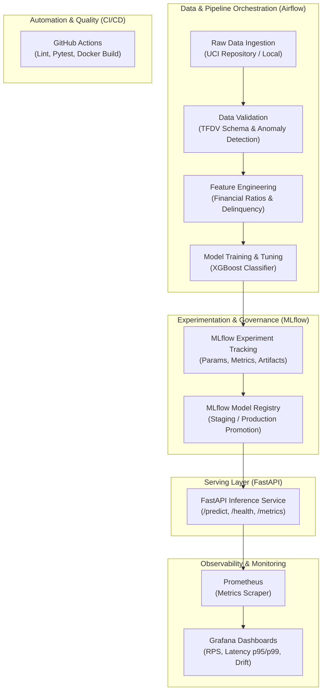

# 💳 Credit Card Default Prediction - End-to-End MLOps Platform

[](https://github.com/uzuz3737/ml-ops-project/actions/workflows/ci-cd.yml)
[](https://www.python.org/downloads/release/python-3110/)
[](https://www.docker.com/)
[](LICENSE)

An enterprise-ready, production-grade MLOps platform for credit risk assessment and default prediction using the **UCI Credit Card Default Dataset**.

---

## 🏗️ Architecture & Tech Stack



| Component | Tool / Technology | Purpose |
| :--- | :--- | :--- |
| **Model Architecture** | [XGBoost](https://xgboost.readthedocs.io/) | Gradient boosted decision trees optimized for tabular financial risk classification |
| **Version Control** | Git / GitHub | Code and configuration version management |
| **Data Validation** | [TFDV (TensorFlow Data Validation)](https://www.tensorflow.org/tfx/data_validation/get_started) | Statistics generation, schema inference, skew and anomaly detection |
| **Experiment Tracking** | [MLflow Tracking](https://mlflow.org/) | Hyperparameter logging, ROC-AUC/PR-AUC curves, and confusion matrix artifacts |
| **Model Registry** | [MLflow Registry](https://mlflow.org/docs/latest/model-registry.html) | Centralized model lifecycle management (Production/Staging stages) |
| **Orchestration** | [Apache Airflow](https://airflow.apache.org/) | Automated weekly DAG executing ingestion, validation, training, and deployment verification |
| **Model Serving** | [FastAPI](https://fastapi.tiangolo.com/) + Uvicorn | High-throughput asynchronous REST API for single and batch predictions |
| **Monitoring** | [Prometheus](https://prometheus.io/) + [Grafana](https://grafana.com/) | Real-time API telemetry (RPS, p95/p99 latency) and inference drift tracking |
| **Containerization** | Docker & Docker Compose | Multi-container orchestration (Airflow, MLflow, FastAPI, Prometheus, Grafana) |
| **CI/CD** | GitHub Actions | Automated linting (`flake8`), unit tests (`pytest`), and Docker image builds |

---

## 📂 Project Structure

```plaintext
ml-ops-project/
├── .github/
│   └── workflows/
│       └── ci-cd.yml                # CI/CD: Linting, Unit testing, Docker build
├── config/
│   └── config.yaml                  # Centralized configuration (paths, hyperparameters)
├── dags/
│   ├── __init__.py
│   └── ml_pipeline_dag.py           # Apache Airflow DAG orchestrating end-to-end steps
├── docker/
│   ├── Dockerfile.airflow           # Airflow custom worker & scheduler image
│   └── Dockerfile.fastapi           # FastAPI inference image with Prometheus exporter
├── monitoring/
│   ├── prometheus.yml               # Prometheus scrape configuration
│   └── grafana/
│       ├── provisioning/
│       │   ├── datasources/         # Auto-provisioned Prometheus datasource
│       │   └── dashboards/          # Auto-provisioned dashboard providers
│       └── dashboards/
│           └── model_monitoring.json # Production Grafana dashboard
├── serving/
│   ├── app.py                       # FastAPI serving application
│   ├── schemas.py                   # Pydantic request/response schemas
│   └── metrics.py                   # Prometheus instrumentation & latency middleware
├── src/
│   ├── data/
│   │   ├── ingestion.py             # Dataset fetch, train/val/test split
│   │   └── validation.py            # TFDV schema inference & anomaly detection
│   ├── features/
│   │   └── engineering.py           # Domain financial features & data cleaners
│   ├── models/
│   │   ├── train.py                 # XGBoost training & MLflow tracking
│   │   ├── evaluate.py              # ROC-AUC, PR-AUC, Confusion Matrix calculation
│   │   └── registry.py              # MLflow Model Registry promotion logic
│   └── utils/
│       ├── config.py                # Config loader
│       └── logger.py                # Structured logging utility
├── tests/
│   ├── test_features.py             # Feature engineering tests
│   ├── test_model.py                # Model training & metrics tests
│   └── test_api.py                  # FastAPI endpoint integration tests
├── docker-compose.yml               # Complete multi-service orchestration
├── requirements.txt                 # Production dependencies
├── requirements-dev.txt             # Testing & CI dependencies
└── README.md
```

---

## 🚀 Quickstart Guide

### Option 1: Full Stack via Docker Compose (Recommended)

To start the complete infrastructure (Airflow, MLflow, FastAPI, Prometheus, Grafana):

```bash
docker compose up --build -d
```

#### Service URLs & Credentials:

| Service | URL | Credentials (if prompted) |
| :--- | :--- | :--- |
| **FastAPI Serving** | [http://localhost:8000](http://localhost:8000) (Swagger: `/docs`) | None |
| **Airflow UI** | [http://localhost:8080](http://localhost:8080) | `admin` / `admin` |
| **MLflow Server** | [http://localhost:5000](http://localhost:5000) | None |
| **Prometheus** | [http://localhost:9090](http://localhost:9090) | None |
| **Grafana** | [http://localhost:3000](http://localhost:3000) | `admin` / `admin` |

---

### Option 2: Local Python Environment

1. **Create and activate virtual environment**:
   ```bash
   python -m venv .venv
   # Windows:
   .venv\Scripts\activate
   # Linux/macOS:
   source .venv/bin/activate
   ```

2. **Install dependencies**:
   ```bash
   pip install -r requirements-dev.txt
   ```

3. **Run Pipeline Stages Locally**:
   ```bash
   # 1. Ingestion
   python -m src.data.ingestion

   # 2. Data Validation (TFDV)
   python -m src.data.validation

   # 3. Model Training & MLflow Tracking
   python -m src.models.train
   ```

4. **Launch Inference API**:
   ```bash
   uvicorn serving.app:app --host 0.0.0.0 --port 8000 --reload
   ```

---

## 📡 API Usage & Endpoints

### 1. Health Check
```bash
curl http://localhost:8000/health
```
**Response**:
```json
{
  "status": "healthy",
  "model_loaded": true,
  "model_version": "Production-Registry",
  "model_source": "models:/CreditCardDefaultXGBoost/Production"
}
```

### 2. Single Customer Default Prediction
```bash
curl -X POST "http://localhost:8000/predict" \
     -H "Content-Type: application/json" \
     -d '{
       "LIMIT_BAL": 50000.0,
       "SEX": 1,
       "EDUCATION": 2,
       "MARRIAGE": 1,
       "AGE": 35,
       "PAY_0": 2,
       "PAY_2": 2,
       "PAY_3": 0,
       "PAY_4": 0,
       "PAY_5": 0,
       "PAY_6": 0,
       "BILL_AMT1": 25000.0,
       "BILL_AMT2": 24000.0,
       "BILL_AMT3": 23000.0,
       "BILL_AMT4": 20000.0,
       "BILL_AMT5": 19000.0,
       "BILL_AMT6": 18000.0,
       "PAY_AMT1": 1500.0,
       "PAY_AMT2": 1500.0,
       "PAY_AMT3": 1000.0,
       "PAY_AMT4": 1000.0,
       "PAY_AMT5": 1000.0,
       "PAY_AMT6": 1000.0
     }'
```
**Response**:
```json
{
  "default_prediction": 1,
  "default_probability": 0.7241,
  "model_version": "Production-Registry"
}
```

### 3. Prometheus Metrics Endpoint
```bash
curl http://localhost:8000/metrics
```

---

## 🧪 Testing & CI/CD

### CatBoost comparison run

CatBoost uses the same ingested train/validation/test splits and shared `prepare_features_and_target` feature engineering as XGBoost. Run it with `python -m src.models.train_catboost`. It logs to the separate `credit_card_default_catboost` experiment and registers as `CreditCardDefaultCatBoost` only when validation ROC-AUC reaches the configured 0.70 gate. Each run logs ROC-AUC, PR-AUC, precision, recall, F1, evaluation plots, data checksums, git revision, CatBoost version, and a `pip freeze` environment artifact. Airflow runs the CatBoost and existing XGBoost tasks in parallel after shared ingestion and validation.

To serve the registered CatBoost Production model, set `serving.model_family: "catboost"` in `config/config.yaml`; the default remains XGBoost.

Run all unit and integration tests with coverage:

```bash
pytest tests/ -v --cov=src --cov=serving --cov-report=term-missing
```

The GitHub Actions workflow at [`.github/workflows/ci-cd.yml`](file:///.github/workflows/ci-cd.yml) automatically runs linting, tests, and builds Docker containers on every pull request to `main`.
